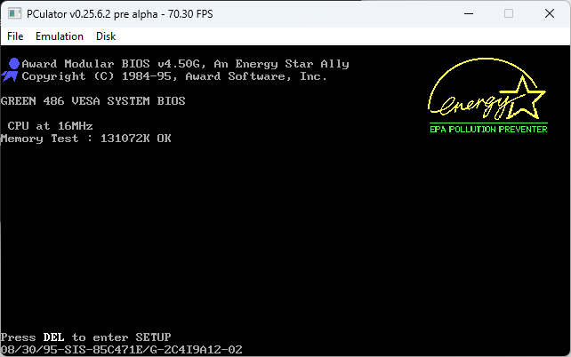
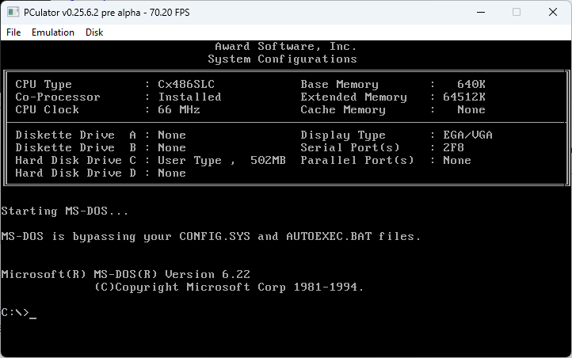
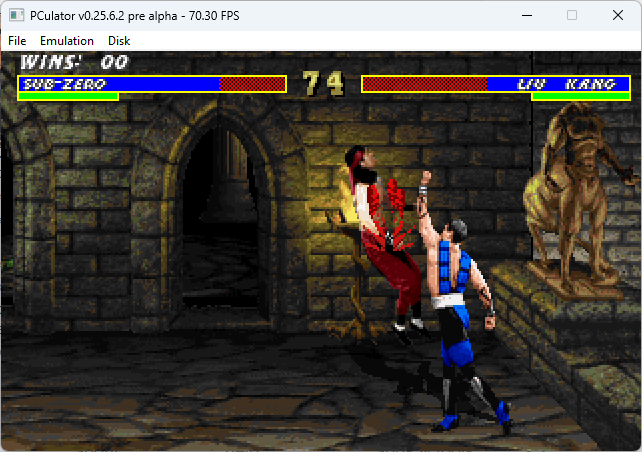
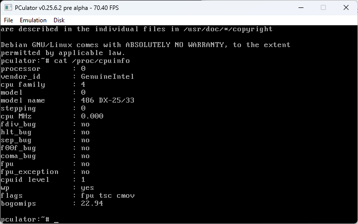

# PCulator - A portable, open source x86 PC emulator

### About

PCulator is an x86 PC emulator that currently targets compatibility with the Intel 486. It also supports some later instructions such as CMOV. It will likely end up going beyond 486 and aim for 686/Pentium Pro compatibility.

It's not particularly fast, since it's an interpreter-style CPU emulator, and not a particularly optimized one at that. Optimization will be worked on after functionality.

It's not clock cycle accurate, nor am I simulating any bus/memory timings. Hyper-accuracy is not a goal of this project, as PC software isn't typically dependent on these things since there was such a wide variation in hardware anyway. There are other projects that tackle accuracy very well if that's what you're after, such as 86Box.

My goal is simply to be able to run Windows 9x/NT, Linux, DOS games, etc.

The code is a mess, and I wanted to clean it up/fix it a lot more before putting it on GitHub, but with that attitude, I'll keep putting it off for who knows how long -- so here it is in all its hideous glory!

### Current status

**WARNING:** *This software is still currently in the early stages, and not really ready for general use. If you are looking for a stable, full-featured emulator that's well-tested, use something else like 86Box. If you just want to play some DOS games, use DOSBox. If you enjoy testing and/or contributing to new software, this is for you!*

This is an extension of my other project XTulator, which is a much simpler and less-ambitious 8086 PC emulator. PCulator currently seems to have the 486 CPU core working fairly well, but there are still some issues with some of the bits surrounding the CPU.

The only 32-bit OS I've currently had luck fully booting into and using is Debian 2.2 "Potato". It also boots MS-DOS and does well with most of the DOS4GW games I've tried. I haven't been able to boot any 32-bit Windows OS, not even Windows 3.1 in 386 enhanced mode.

I haven't implemented a floppy controller or CD-ROM drives yet, so you can't install an OS from within PCulator at this point. I've been doing installations to hard disk images with QEMU or 86Box, and then booting the image in PCulator. My ATA controller is incomplete and apparently slightly broken, as Linux will occasionally hang for a few moments and then spit out "hda: lost interrupt" before continuing when accessing the disk. It's rare, but annoying.

Also, keep in mind that this works like a *real* 486 PC, meaning it runs a real 1990's era 486 BIOS when it starts, so you'll have to make sure you go into the BIOS setup and configure your disk image's geometry before booting it! Just like back in the day. You can use the BIOS's IDE auto-configure option as well. You'll need to do this any time you are using a different size disk image than you did last time.

**HINT:** *The keyboard controller is also slightly broken. It works in DOS/Linux just fine, but the BIOS will complain about it and give you a warning, so you should turn off halting on errors in the BIOS setup until I get that fixed.*

There is also an emulated NE2000 network card that uses pcap/npcap, but it starts dropping packets if you try to push it too hard.

Finally, you'll see a lot of evidence in the code that this was originally an emulator for an 8086 16-bit PC. There is a lot of clean-up and refactoring still left to do.

### Features

- 486 CPU (plus a few Pentium+ instructions... let's just call it an "enhanced 486" for now)
- ATA/IDE controller
- CGA/VGA graphics
- Microsoft-compatible serial mouse
- NE2000 network card (borrowed from Bochs)
- Sound Blaster (my implementation) + OPL3 (NukedOPL)

### Compiling

I'm doing all my development on Windows 11 with Visual Studio 2022. I haven't tried to compile it for Linux or Mac yet. The free Community version is fine, that's what I'm using.

You will need to install the [SDL2](http://www.libsdl.org) and [Npcap](https://nmap.org/npcap/) development libraries.

If you really want to compile on Linux/Mac, you should be able to get it working easily enough.

### Some screenshots

