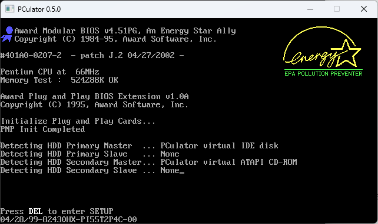
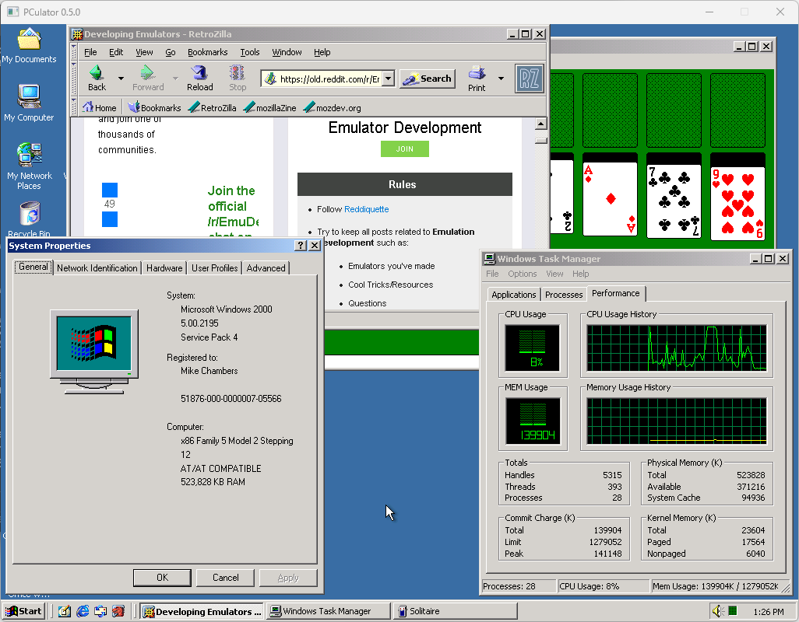
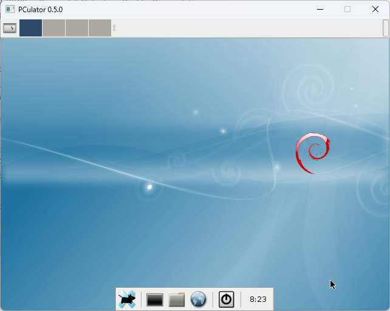
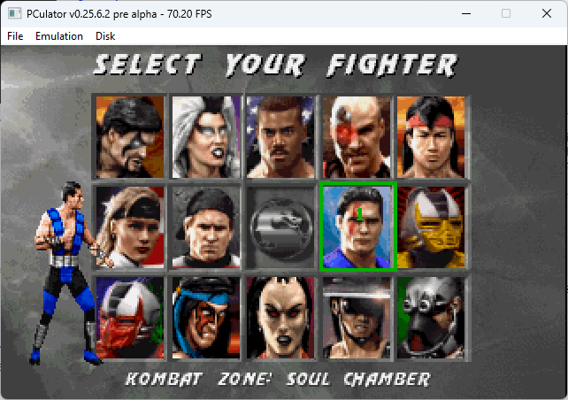
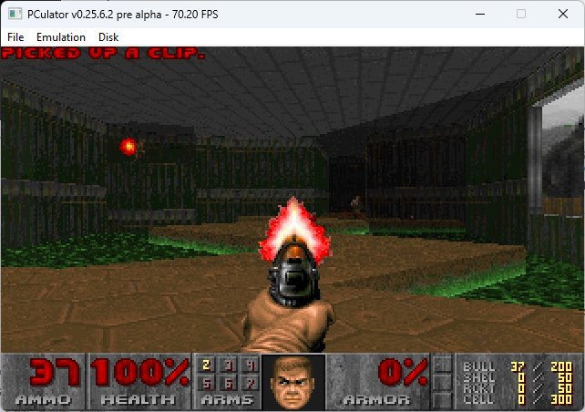
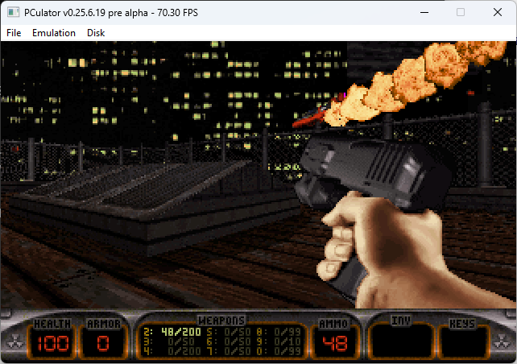
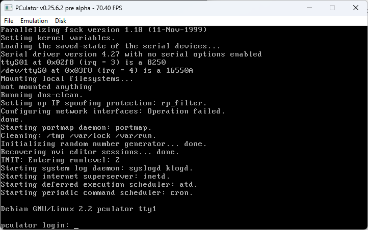

# PCulator - A portable, open source x86 PC emulator

### About

PCulator is an x86 PC emulator that currently targets compatibility with the Intel Pentium. It also supports some later instructions such as CMOV.

It's currently only an interpreter-style CPU emulator, there is no dynamic recompilation so you will not get speed on par with some other emulators. A modern host CPU with high clock speed and high IPC is preferable.

This is a one-man hobby project and there are still issues to fix, but it does already run Windows NT/2000, Linux, and DOS.

It's been tested extensively on Windows, and has also been confirmed to compile and run on several Linux distributions.

Currently, only raw format hard disk images are supported. Support for other formats such as qcow and vdi is planned. Also, only ISO format CD/DVD images are supported right now. Support for bin/cue and others is planned.

### ROM files and sample disks

You can find the ROM pack and sample hard disk images here: https://files.pculator.com

The ROM files are already included in the Windows build under the releases section.

### Current status

### Features

- Pentium-class CPU
- ATA hard disk support
- ATAPI CD-ROM drive support
- SVGA graphics (Cirrus Logic GD5440)
- Microsoft-compatible serial mouse and PS/2 mouse
- NE2000 network card (borrowed from Bochs)
- rtl8139 network card (borrowed from 86Box)
- Sound Blaster 16 (my implementation) + OPL3 (NukedOPL)
- BusLogic BT-545S SCSI controller
- SCSI hard disk and CD-ROM support
- ISA and PCI bus
- i430FX and i430HX chipset support

##### Known working guest OSes:
- Windows 3.0
- Windows NT 4.0
- Windows 2000 Professional and Server
- Various Linux distributions
- MS-DOS (including DOS4GW based games and many others)

##### Known non-functional guest OSes:
- Windows 3.1/3.11
- Windows 95/98

### Usage

You can run **PCulator -h** for a full listing of runtime options, but the following is a basic command line that will launch it with mydisk.img attached to the primary master IDE channel, and will provide an empty CD-ROM drive on the secondary master IDE channel. It will also attach an NE2000 network adapter to the machine at IO 0x300 and IRQ 10, using host pcap interface #1.

    PCulator -hd0 mydisk.img -cd2 . -nic ne2000 -net 1

You will need npcap (with Winpcap API compatible mode enabled) installed on Windows to use networking. Use **-net list** to get a listing of your host's network adapters and their interface numbers.

### Hotkeys
- Right Ctrl + F10 = Show/hide control panel on SDL frontend (basic status display and floppy/CD media controls)
- Right Ctrl + F11 = Grab/ungrab mouse (Clicking inside the window will also grab the mouse)
- Right Ctrl + F12 = Inject ctrl-alt-delete into the guest OS

### Compiling

On Windows, the supported method of compiling is by loading the solution file into Visual Studio and doing a build. The configure script may work in a MinGW or Cygwin style environment, but I haven't tried.

On Linux, you can run the configure script and then make. You will need to install several dev libraries as a prerequisite. On Debian/Ubuntu, you can use the following command to do so:

    sudo apt install libsdl2-dev libpcap-dev libvncserver-dev
   
libvncserver is optional. If you install it, you can enable the optional VNC server frontend like this:

    ./configure --with-frontends=sdl,vnc
   
The VNC server is experimental and has not been tested much at all.

### Some screenshots

